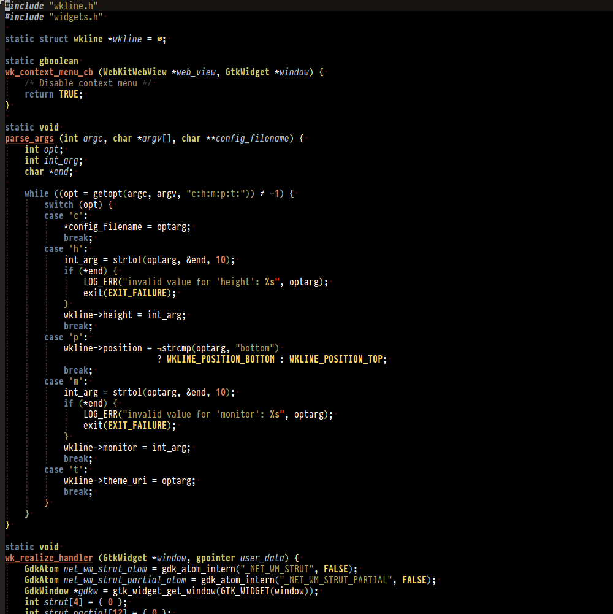

# distinguished-theme

A modified port of the distinguished theme for vim. Requires Emacs 24.



Note that custom highlighting isn't supported for a lot of packages yet, support for
other packages will be added gradually.

## Installation

Install from MELPA:

```
M-x package-install RET distinguished-theme
```

Load the theme with `M-x load-theme RET distinguished-theme`.

To set distinguished as the default theme, add this to your init file:

```lisp
(load-theme 'distinguished-theme t)
```
